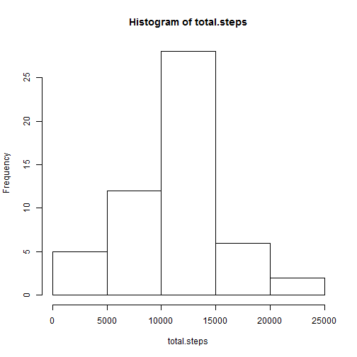

# report title


```r
require(knitr)
```

```
## Loading required package: knitr
```

```r
opts_chunk$set(echo = TRUE, cache = TRUE, cache.path = "cache/", fig.path = "figure/")
```

First we load the data and transform date field to Date.

```r
activity <- read.csv("activity.csv")
activity$date <- as.Date(as.character(activity$date),format="%Y-%m-%d")
```
Second we aggregate the data by date and calculate the sums of the steps in each date and the mean and the median of the daily number of steps

```r
daily.steps <- aggregate(activity$steps,by=list(activity$date),FUN=sum)
colnames(daily.steps) <- c("date","total.steps")
mean.steps <- mean(daily.steps$total.steps,na.rm=TRUE)
#mean daily steps
mean.steps
```

```
## [1] 10766.19
```

```r
median.steps <- median(daily.steps$total.steps,na.rm=TRUE)
#median daily steps
median.steps
```

```
## [1] 10765
```
So, the mean number of daily steps is 10766.19 and the median number of daily steps is 10765. Next we plot a histogram of daily steps using previously calculated data.

```r
with(daily.steps,hist(total.steps))
```

 
Next we aggregate the average number of steps taken by 5 minute intervaland build a corresponding plot, also filtering out NA values.

```r
activity.non.na <- activity[!is.na(activity$steps),]
interval.steps <- aggregate(activity.non.na$steps,by=list(activity.non.na$interval),FUN=mean)
colnames(interval.steps) <- c("interval","mean.steps")
#plot the chart
with(interval.steps,plot(interval,mean.steps,type="l"))
```

 

```r
#get the interval with maximum average steps
subset(interval.steps,mean.steps==max(interval.steps$mean.steps))$interval
```

```
## [1] 835
```
So, the interval with the maximum average steps is 835. Next we work with the missing data. First we calculate the total number of NAs in the data set.

```r
sum(is.na(activity$steps))
```

```
## [1] 2304
```
So, the total number of missing values is equal to 2304. Next we fill out the missing values. Our strategy for filing will be to fill the values with the mean number of steps for that interval. 

```r
activity.filled <- activity
for(i in 1:length(activity.filled$steps)){
    if(is.na(activity.filled$steps[i])){
        activity.filled$steps[i] <- subset(interval.steps,interval==activity.filled$interval[i])$mean.steps
    }
}
```

So, we created a data set with NAs filled, which is called activity.filled. Next we re-build a histogram of the total number fo steps taken each day and re-calculate the average and the median.

```r
daily.steps.filled <- aggregate(activity.filled$steps,by=list(activity.filled$date),FUN=sum)
colnames(daily.steps.filled) <- c("date","total.steps")
mean.steps.filled <- mean(daily.steps.filled$total.steps,na.rm=TRUE)
#mean daily steps
mean.steps.filled
```

```
## [1] 10766.19
```

```r
median.steps.filled <- median(daily.steps.filled$total.steps,na.rm=TRUE)
#median daily steps
median.steps.filled
```

```
## [1] 10766.19
```

```r
with(daily.steps.filled,hist(total.steps))
```

 

So, our method of filling does not change the average (it should not) and makes the median equal to the average 10766.19. Next we create a factor variable to distinguish between weekdays and weekend.

```r
weekdays.labels <- unique(weekdays(activity.filled$date))[1:5]
activity.filled$wDay <-  factor((weekdays(activity.filled$date) %in% weekdays.labels)+1L,
                                levels=1:2, labels=c('weekend', 'weekday'))
```
Now we build a plot of average number of steps for weekdays and weekends.

```r
require(lattice) 
```

```
## Loading required package: lattice
```

```r
interval.steps.wday <- aggregate(subset(activity.filled,wDay=="weekday")$steps,by=list(subset(activity.filled,wDay=="weekday")$interval),FUN=mean)
interval.steps.wend <- aggregate(subset(activity.filled,wDay=="weekend")$steps,by=list(subset(activity.filled,wDay=="weekend")$interval),FUN=mean)
colnames(interval.steps.wday) <- c("interval","mean.steps")
colnames(interval.steps.wend) <- c("interval","mean.steps")
interval.steps.wday$wday <- "weekday"
interval.steps.wend$wday <- "weekend"
xyplot(mean.steps ~ interval | wday, data=rbind(interval.steps.wend,interval.steps.wday),layout = c(1, 2),type="l")
```

 

